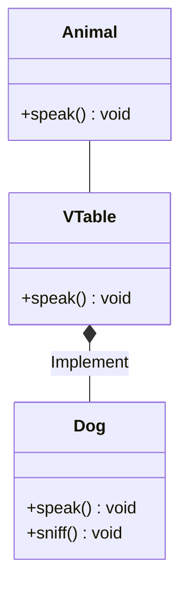

I've started to learn Zig to build some fun projects that I'll be written about
at future. Bug I got a giant bottleneck at this process, and it was the
interfaces. Unlike other languages that have specific implementation and syntax
sugar Zig doesn't do that, we need the use of compile time types or
[vtables](https://en.wikipedia.org/wiki/Virtual_method_table) at runtime.

I'll make a deep coverage about the matter to help you to understand it.

 Zig isn't stable and can change between updates.
This post is written at **version 0.16**. 

## What Is an Interface?

I'll not write about the basics of the interfaces and it concept, but it'll be
about how it works and how it's implemented. When we need some level of
polymorphism most of the time we can't define it at compile time. So the
computer need some way to know that a method defined in Dog, for example the
method speak() is the representative of the method speak() of the Animal class.
To handle that we use a mechanism named
[vtable](https://en.wikipedia.org/wiki/Virtual_method_table), with it we assign
each method from the hypothetical Animal class to an index at a vtable in Dog
class and the corresponding Dog's method pointer to the index.

## Acknowledgment

- [Wikipedia: vtable](https://en.wikipedia.org/wiki/Virtual_method_table)
- [Stack Overflow: How are interfaces represented at a lower/assembly level?](https://stackoverflow.com/questions/60104481/how-are-interfaces-represented-at-a-lower-assembly-level)
