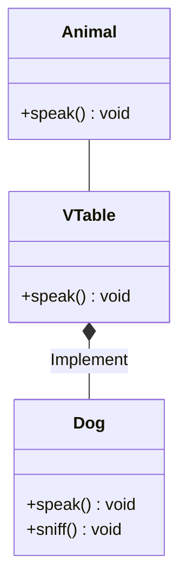

I've started to learn Zig to build some fun projects that I'll be written about
at future. Bug I got a giant bottleneck at this process, and it was the
interfaces. Unlike other languages that have specific implementation and syntax
sugar Zig doesn't do that, we need the use of compile time types or
[vtables](https://en.wikipedia.org/wiki/Virtual_method_table) at runtime.

I'll make a deep coverage about the matter to help you to understand it.

 Zig isn't stable and can change between updates.
This post is written at **version 0.16**. 

## What Is an Interface?

I'll not write about the basics of the interfaces and it concept, but it'll be
about how it works and how it's implemented. When we need some level of
polymorphism most of the time we can't define it at compile time. So the
computer need some way to know that a method defined in `Dog`, for example the
method `speak()` is the representative of the method `speak()` of the `Animal`
class. To handle that we use a mechanism named
[vtable](https://en.wikipedia.org/wiki/Virtual_method_table), with it we assign
each method from the hypothetical Animal class to an index at a vtable in `Dog`
class and the corresponding `Dog` method pointer to the index.



## Union

Unlike other languages that only have runtime interfaces Zig also implement a
compile-time interface. It's implementation use a static check at the methods
and fields of a struct to ensure that it complains with the required fields and
methods of the callee method. If you're a rust programmer you'll be a bit
familiar with this method. It's like rust's enum, we'll group the types that we
want to implement the interface in a union. This union will handle the internal
calls to the real struct using a pattern matching. Let's see some code examples.

First define your interface and objects that implement it. I'll stick with the
well know shape example. So let's create the structures that implement the
`area()` method.

```zig {filename="shape.zig"}
pub const Circle = struct {
    radius: f32,

    pub fn area(self: *Circle) !f32 {
        return 3.14 * self.radius * self.radius;
    }
};

pub const Rectangle = struct {
    width: f32,
    height: f32,

    pub fn area(self: *Rectangle) !f32 {
        if (self.width < 0.0 or self.height < 0.0) {
            return error.InvalidShape;
        }
        return self.width * self.height;
    }
};
```

Now let's implement the [union](https://zig.guide/language-basics/unions) that
will have inside it the `circle` and `rectangle` fields. After that we need to
implement the `area()` method and inside it handle the pattern matching to
forward the correct method call to the selected shape.

```zig {filename="shape.zig"}
pub const Shape = union(enum) {
    circle: Circle,
    rectangle: Rectangle,

    pub fn area(self: *Shape) !f64 {
        switch (self.*) {
            inline else => |*shape| return try shape.area(),
        }
    }
};
```

The last step is to import our `shape.zig` at `main.zig` and test the
implementation.

```zig {filename="main.zig"}
const std = @import("std");
const shapes = @import("shape.zig");

pub fn main() !void{
    var shape = shapes.Shape{ 
        .rectangle = shapes.Rectangle{ .width = 10, .height = 20 } 
    };
    std.debug.print("Area of shape {}\n", .{try shape.area()});

    shape = shapes.Shape{ .circle = shapes.Circle{ .radius = 10} };
    std.debug.print("Area of shape {}\n", .{try shape.area()});
}
```

If you have a sharp eye to optimization is easy and obvious to notice the big
flaw of this method. For every method call that our code does it needs to do a
pattern matching before execute the method itself. It causes a significant
overhead for critical systems. Also every time that you wish to add a new object
to this interface you'll need to add a new field and even modify some methods.

## Reference Pointer

## Acknowledgment

- [Wikipedia: vtable](https://en.wikipedia.org/wiki/Virtual_method_table)
- [Stack Overflow: How are interfaces represented at a lower/assembly level?](https://stackoverflow.com/questions/60104481/how-are-interfaces-represented-at-a-lower-assembly-level)
- [Jerry Thomas: Exploring Compile-Time Interfaces in Zig](https://medium.com/@jerrythomas_in/exploring-compile-time-interfaces-in-zig-5c1a1a9e59fd)
- [Karl Seguin: Zig Interfaces](https://www.openmymind.net/Zig-Interfaces/)
