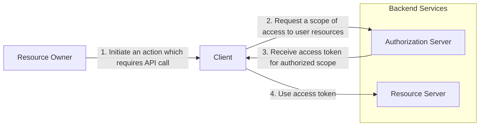

In the past, if you wanted to allow an application to access another service on
your behalf, you had to share your credentials with it. This created several issues.
For example, if you changed your password, you would have to update it in
every app. Furthermore, you couldn't revoke access for a single specific
app without changing your password for everyone
So OAuth came to help us to solve this issue.
It permits a client to act as the user (or on behalf of the user) without ever
seeing or storing the user's credentials.

At the time of writing OAuth 2.1 is still in development,
so for this series, we'll stick with the 2.0.

## Roles

Roles are a core part of the OAuth 2.0 Authorization Framework.
They separate the workflow, isolating each part into a single responsibility.
These are the rules implemented:

- **Resource Owner:** The user or entity that owns the resource
and grants access to it.
- **Client:** The application requesting access to the resource on
behalf of the resource owner. It can be a website, mobile app, and other frontends.
- **Authorization Server:** The server that authenticates the resource owner
and issues access tokens to the client.
- **Resource Server:** The server hosting the resource that the client wants to
access. You can think of it as the API that you want to call.

## Scopes

Scopes define what level of access the client is requesting.
They limit what actions the client can perform on behalf of the resource owner.

Think of scopes as permissions.
When you authorize an app, you're granting specific capabilities and not full access.

## Tokens

The *Authorization Server* may return an *Authorization Code* that can be exchanged
for an *Access Token*, some *Authorization Server* also issue a *Refresh Token*.

- **Access Token:** Allow the client to access protected resources on behalf
of the resource owner. Normally this token has a short lifespan
- **Refresh Token:** Unlike *Access Token*, it normally has a longer expiration time
and it's used to renew the client's *Access Token*.

## How It Works?

To understand the flow, let's look at how these roles interact in a
standard scenario. The diagram below illustrates the abstract protocol flow:

Here is the step-by-step breakdown of the process:

1. **Initiation:** The *Resource Owner* (the user) attempts to perform an action
within the Client application that requires data from an external service.
2. **Authorization Request:** The Client redirects the request to the
*Authorization Server*. It specifies which Scopes (permissions) it needs.
3. **Token Issuance:** If the user approves the request, the
*Authorization Server* validates the request and issues an
*Access Token* back to the Client.
4. **Resource Access:** The Client can now request the actual data.
It sends a request to the *Resource Server* (the API) usually attaching the
*Access Token* in the header.
The *Resource Server* validates the token and returns the data.

## Grant Types

A grant is a set of steps that a client must perform to get access to the resource.
The OAuth framework specifies several grant types to accommodate different use cases.
The most common are:

- **Authorization Code:** The authorization provides a single-use code that
can be exchanged for an *Access Token*.
- **Proof Key for Code Exchange(Recommended):** Is an extension of the
Authorization Code flow that prevents authorization code injection attacks.
- **Client credentials:** Is used to obtain the *Access Token* without user
interaction in a Machine-to-Machine situation. The authentication is made using
the client id and a secret.
- **Device Code:** Used for browserless or input-constrained devices
(like smart TVs and smartwatches) making an exchange
of a previously obtained code for an *Access Token*.
- **Refresh Token:** Used to get a new *Access Token* when the last is expired.
- ~**Implicit Flow:**~ Older guides might mention it,
but it's no longer secure or recommended.

## Acknowledgement

- [Solving Identity Management in Modern Applications](https://amzn.to/4qmt04u)
- [What is OAuth 2.0?](https://auth0.com/intro-to-iam/what-is-oauth-2)
- [OAuth 2.0 Community](https://oauth.net/2/)
